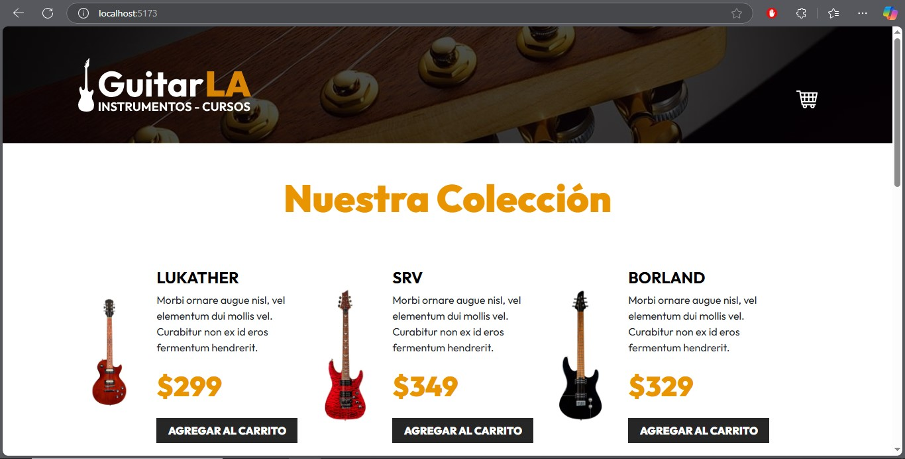
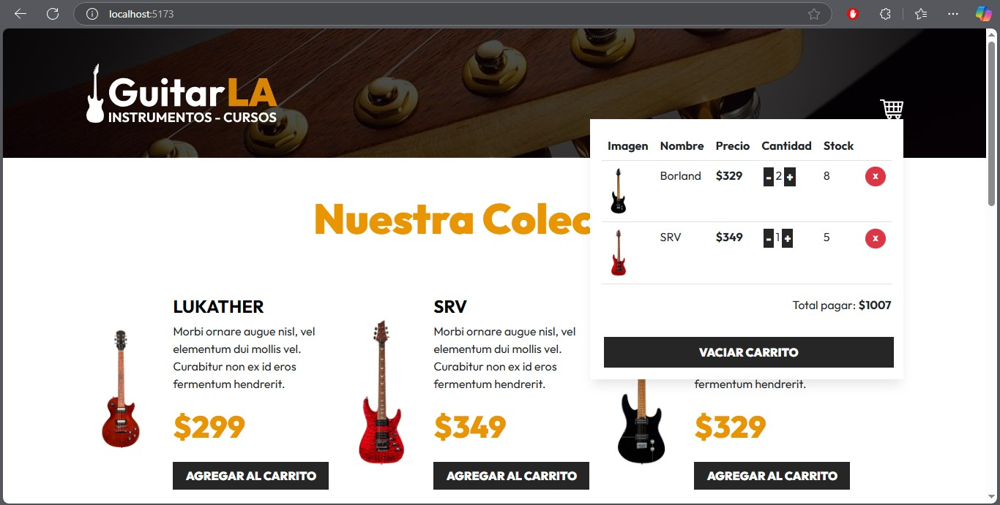

# GuitarLA

Proyecto desarrollado en React + Vite, consiste en un carrito de compras de guitarras. 
Los datos de las guitarras provienen de un archivo para poder renderizarlas.

## Acciones:
* Agregar o eliminar del carrito guitarras.
* Aumentar o disminuir cantidades de guitarras.
  



## Pasos:
* Instalación de paquetes 
```
npm install
```
* Ejecutar en modo de desarrollo
```
npm run dev
```
* Construir proyecto para producción
```
  npm run build
```
* Ubicación
```
cd dist/
```
* Ejecutar proyecto en producción
```
npm run preview
 
 localhost:4173
```
